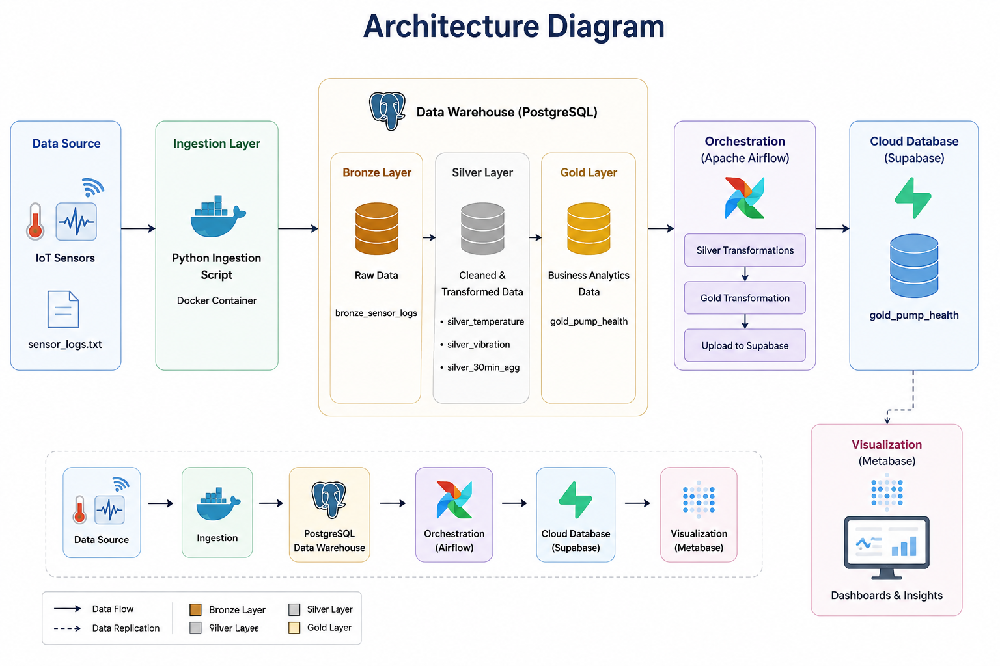
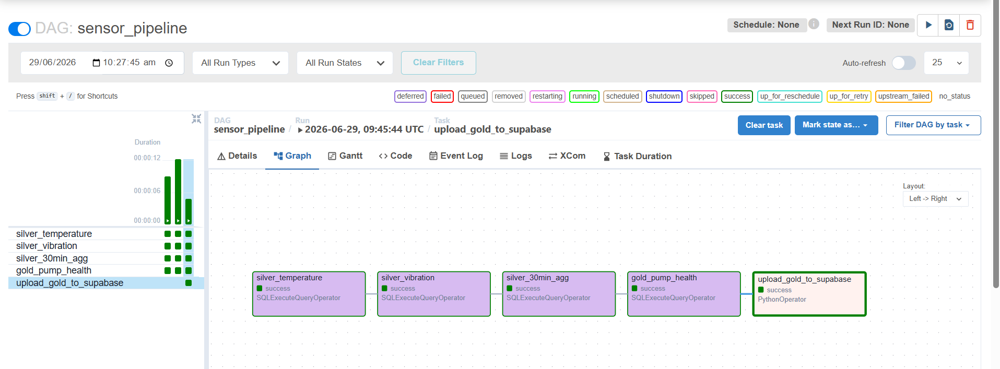
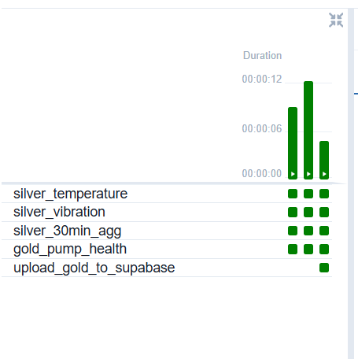

# iot-sensor-data-pipeline
## Project Overview
This project implements an end-to-end IoT data engineering pipeline using Python, PostgreSQL, Apache Airflow, Supabase, and Metabase. The pipeline ingests industrial IoT sensor data, transforms it using the Medallion Architecture (Bronze, Silver, Gold), orchestrates workflows using Apache Airflow, replicates analytical data to Supabase, and visualizes insights using Metabase dashboards.
## Problem Statement
Industrial IoT environments generate large volumes of sensor data continuously. Raw sensor data is difficult to analyze directly due to its size, noise, and lack of business context. The goal of this project is to design a scalable ELT pipeline that transforms raw sensor readings into business-ready analytical datasets for monitoring equipment health and operational performance.
## Project Objectives
- Build an end-to-end ELT pipeline
- Implement Medallion Architecture
- Orchestrate transformations with Apache Airflow
- Replicate analytical data to cloud storage
- Visualize business metrics using Metabase
- Containerize the entire platform using Docker
## Project Architecture Overview

## Data Flow
```
Sensor Logs 
    ↓
Python Ingestion
    ↓
PostgreSQL Bronze
    ↓
Apache Airflow
    ↓
Silver Layer
    ↓
Gold Layer
    ↓
Supabase
    ↓
Metabase Dashboard
```
## Technology Stack Used
- **Programming:** Python
- **Database:** PostgreSQL
- **Workflow:** Apache Airflow
- **Cloud Database:** Supabase
- **Visualization:** Metabase
- **Containerization:** Docker
- **Package Manager:** UV
- **Data Processing:** Pandas
- **SQL Engine:** PostgreSQL SQL
## Medallion Architecture
### Bronze Layer
**bronze_sensor_logs**
| Column        | Data Type | Description              |
|---------------|-----------|--------------------------|
| timestamp     | TIMESTAMP | Sensor reading timestamp |
| pump_id       | VARCHAR   | Pump identifier          |
| sensor_type   | VARCHAR   | Temperature/Vibration    |
| sensor_value  | FLOAT     | Actual sensor reading    |
### Silver Layer
**silver_temperature**

| Column        | Data Type | Description              |
|---------------|-----------|--------------------------|
| timestamp     | TIMESTAMP | Sensor reading time      |
| pump_id       | VARCHAR   | Pump identifier          |
| temperature   | FLOAT     | Temperature value        |

**silver_vibration**

| Column        | Data Type | Description              |
|---------------|-----------|--------------------------|
| timestamp     | TIMESTAMP | Sensor reading time      |
| pump_id       | VARCHAR   | Pump identifier          |
| vibration     | FLOAT     | vibration value          |

**silver_30min_agg**

| Column              | Data Type | Description               |
|---------------------|-----------|---------------------------|
| window_start        | TIMESTAMP | Aggregation window        |
| pump_id             | VARCHAR   | Pump identifier           |
| avg_temperature     | FLOAT     | Average temperature       |
| avg_vibration       | FLOAT     | Average vibration         |

### Gold Layer

**gold_pump_health**

| Column              | Data Type | Description                |
|---------------------|-----------|----------------------------|
| pump_id             | VARCHAR   | Pump identifier            |
| avg_temperature     | FLOAT     | Average temperature        |
| avg_vibration       | FLOAT     | Average vibration          |
| health_status       | VARCHAR   | Pump health classification |

### Workflow Orchestration

